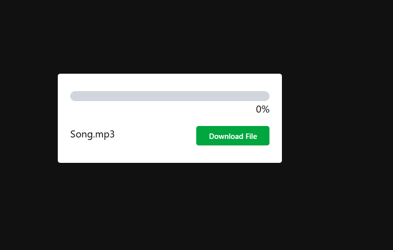
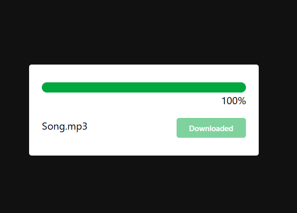

# 📥 Progress Bar File Downloader UI

A simple and elegant progress bar animation using HTML, CSS (with TailwindCSS), and JavaScript.  
The UI simulates a file download with a growing progress bar and percentage counter.

---

## 🚀 Features

- Modern UI using TailwindCSS
- Simulated download progress with animated progress bar
- JavaScript-based timer logic
- Button disables after download is complete

---

## 📸 Screenshot



 
 <!-- Optional: Add screenshot if available -->

---

## 🛠️ Tech Stack

- HTML5
- Tailwind CSS
- JavaScript

---

## 📁 Project Structure

```
project-folder/
├── index.html
├── style.css
├── script.js
└── README.md
```

---

## ▶️ How to Use

1. Clone the repository:
   ```bash
   git clone https://github.com/your-username/progress-bar-downloader.git
   ```
2. Open `index.html` in your browser.
3. Click the **Download File** button to see the progress bar in action.

---

## ✨ Demo

You can see a live demo here:  
🔗 [Demo Link](#) *(replace with actual GitHub Pages or hosted link)*

---

## 📄 License

This project is open source and free to use under the [MIT License](LICENSE).

---

## 💡 Author

Made with ❤️ by [Ankit Kumar Choubey](https://github.com/your-username)